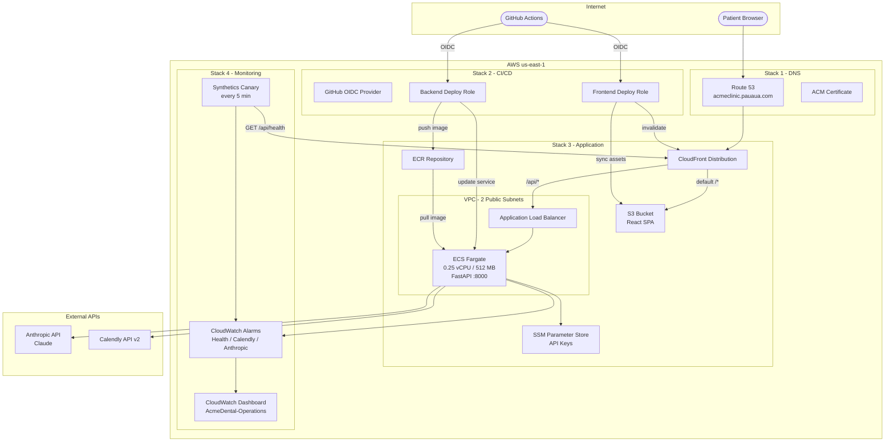

# Acme Dental Infrastructure

AWS CDK (Python) infrastructure for the Acme Dental AI Agent. Four stacks deployed in sequence to `us-east-1`.

## Architecture



## Stacks and Deploy Order

| # | Stack | Resources | Purpose |
|---|-------|-----------|---------|
| 1 | **DnsStack** | Route 53 hosted zone, ACM certificate | DNS resolution and TLS for `acmeclinic.pauaua.com` |
| 2 | **CiCdStack** | GitHub OIDC provider, 3 IAM deploy roles | CI/CD authentication without static AWS credentials |
| 3 | **AppStack** | VPC, ECS Fargate, ALB, S3, CloudFront, ECR | Application compute, frontend hosting, CDN |
| 4 | **MonitoringStack** | Synthetics canary, 3 CloudWatch alarms, dashboard | Health checks, error alerting, operational visibility |

## Key Architectural Decisions

| Decision | Rationale |
|----------|-----------|
| **Public subnets only, no NAT Gateway** | NAT costs ~$32/month — unnecessary for a demo where the Fargate task only needs outbound internet (public IP + IGW is sufficient) |
| **CloudFront path-based routing** | Single domain serves both SPA (`/*` to S3) and API (`/api/*` to ALB), eliminating CORS issues entirely |
| **GitHub OIDC, no static keys** | IAM roles assumed via short-lived tokens — no AWS access keys stored in GitHub Secrets |
| **SSM Parameter Store for secrets** | API keys (Anthropic, Calendly) stored as SecureStrings, injected at runtime via ECS task role — never in Docker images, env files, or CI logs |
| **Least-privilege IAM roles** | Each CI/CD role (backend, frontend, infra) has only the permissions it needs — no shared admin key |
| **Synthetics canary + custom metric alarms** | Health check every 5 min via real HTTP request; alarms on Calendly/Anthropic error rates catch upstream API degradation |
| **Single-task Fargate, no auto-scaling** | Right-sized for demo/interview traffic (~$12/month for compute); auto-scaling group would be the next step for production |

## Estimated Monthly Cost

| Resource | Cost |
|----------|------|
| ECS Fargate (0.25 vCPU, 512 MB, 1 task) | ~$12 |
| ALB | ~$16 |
| CloudFront (low traffic) | ~$1 |
| Route 53 hosted zone | $0.50 |
| S3 (frontend + canary artifacts) | < $1 |
| CloudWatch (metrics, alarms, dashboard) | ~$3 |
| **Total** | **~$33/month** |

## Usage

```bash
# Install dependencies
pip install -r requirements.txt

# Deploy (in order)
cdk deploy AcmeDental-Dns
# → Add NS records to domain registrar, wait for propagation
cdk deploy AcmeDental-CiCd
cdk deploy AcmeDental-App
cdk deploy AcmeDental-Monitoring
```
